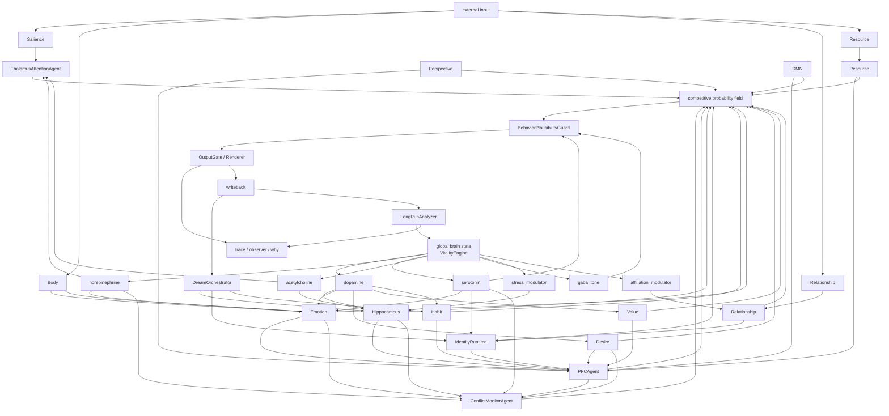

# NALR v0.57 类脑神经调制映射与 Structured Instability 落地方案

## 目的

本文将当前仓库中已经明确出现的核心运行时模块，统一映射到“神经调制 + 局部竞争 + 结构化失控”框架下，并给出一套可落地的 wiring 方案。这里的目标不是宣称“这就等于真人脑”，而是尽量按**功能同构**来对齐：也就是让模块承担尽可能接近真实脑机制的作用，而不是只换一个脑区名字。仓库 README 当前明确给出了主链模块、慢变量模块、冲突闭环、概率链、身份/真实性/生命性/梦境链路，以及 `RuntimeController`、`PFCAgent`、`ConflictMonitorAgent`、`ThalamusAttentionAgent`、`SkillExecutor` 等骨架。citeturn372083view0

---

## 一、先定边界：什么叫“类脑对齐”，什么不叫

### 1. 不做错误承诺
真实人脑不是一个显式的 `Δ -> normalize -> merge` 系统，也没有单一、全局、同步的融合器。人脑更接近**分布式竞争 + 神经调制 + 多层抑制回路**。因此，本文所有映射都应理解为：

- **功能对齐**：谁在系统里承担了类似作用
- **动力学对齐**：谁在何时放大、抑制、切换状态
- **失控形态对齐**：哪些失控是“像人”的，哪些只是系统坏掉了

### 2. Structured Instability 的定义
“有结构的失控”不是取消所有约束，而是把约束从“显式标准化”移到“调制系统、门控、抑制、回拉与恢复机制”。人类会：
- 情绪上头
- 注意力失衡
- 冲动压过长期目标
- 记忆被情境劫持
- 身份叙事在压力下收缩或扭曲

但人脑通常仍然保留：
- 某种可恢复的吸引子
- 某种抑制回路
- 某种慢变量回拉
- 某种睡眠/离线重整

因此，类人的意义不是“完全不要控制”，而是：
> 允许调制层波动、漂移、过激、迟钝、偏置，但不允许系统失去最基本的可恢复结构。

---

## 二、当前 repo 模块到神经调制体系的一一映射

README 当前主链明确包含：`Salience / Body / Emotion / Relationship / Resource -> PFC candidate generation -> Habit / Desire / DMN / Hippocampus / Perspective / Value -> ConflictMonitor -> Thalamus sampling -> BehaviorPlausibilityGuard -> OutputGate / Renderer -> trace / writeback / health check`，慢变量链包含 `VitalityEngine -> DreamOrchestrator -> memory / habit / relation / identity shaping`，另有 `IdentityRuntime`、`AuthenticityPolicy`、`LongRunAnalyzer` 和 `SkillExecutor`。citeturn372083view0

下面采用“模块 -> 最主要神经调制/功能系统 -> 次级系统 -> 真实效用对齐”的方式展开。

---

### A. 调度与总线层

#### 1. `RuntimeController`
- **主对应**：丘脑-皮层-基底节之间的路由编排，不是单一脑区
- **调制归属**：不直接等价于 dopamine / norepi / serotonin 中任何一个
- **真实效用对齐**：
  - 更像“多回路编排壳”
  - 负责时序、门控、回写、恢复
- **工程原则**：
  - 不要把它叫“前额叶”
  - 它应该是**回路编排器**，不是认知本体

#### 2. `SkillExecutor`
- **主对应**：前额叶-纹状体的“外部动作 affordance 评估” + 额顶控制网络的工具调用控制
- **主调制**：
  - dopamine：工具值得不值得试
  - serotonin：是否克制高成本/高风险调用
  - norepinephrine：在高不确定时是否切换到外部工具
- **真实效用对齐**：
  - 不像“技能模块”，更像“行动可能性评估器”
  - 真实人脑不会把工具视为外挂，而是视为延伸动作系统

---

### B. 输入前处理 / 状态信号层

#### 3. `Salience`
- **主对应**：显著性网络（anterior insula / ACC 功能组合）
- **主调制**：norepinephrine
- **次调制**：acetylcholine
- **真实效用对齐**：
  - 不是“重要性分数”
  - 而是“哪些东西值得抢占当前处理资源”
- **Structured Instability 表现**：
  - 显著性过高：系统被小刺激劫持
  - 显著性过低：系统迟钝、抓不住关键信号

#### 4. `Body`
- **主对应**：内感受与自主状态映射（insula / hypothalamic body-state integration）
- **主调制**：
  - serotonin：稳定性、抑制性
  - norepinephrine：警觉/应激
- **真实效用对齐**：
  - 不是“生理字段”
  - 而是整体脑态的底噪和阈值条件
- **Structured Instability 表现**：
  - 身体负荷高时，系统应更短视、更保守或更易烦躁

#### 5. `Emotion`
- **主对应**：边缘系统的情绪偏置层（amygdala-centered bias，不等于单一杏仁核）
- **主调制**：
  - norepinephrine：警觉性和急迫度
  - dopamine：趋近、冲动、期待
  - serotonin：情绪抑制与稳定
- **真实效用对齐**：
  - 情绪不是标签，而是对候选分布的增益/削弱机制
- **Structured Instability 表现**：
  - 可允许短时支配行为
  - 但必须被长期层与 guard 追踪，而不是完全无痕

#### 6. `Relationship`
- **主对应**：社会认知与依附边界系统（mPFC / TPJ / attachment-related valuation）
- **主调制**：
  - oxytocin-like social bonding analogue（工程上可单独命名为 `affiliation_modulator`）
  - serotonin：边界保持
- **真实效用对齐**：
  - 决定披露、亲近、安抚、疏离、界限
- **Structured Instability 表现**：
  - 高关系张力时，可能放大迎合、退缩、防御或过度解释

#### 7. `Resource`
- **主对应**：机会成本 / 能量预算 / 执行代价估计
- **主调制**：
  - dopamine：是否值得投入更多资源
  - serotonin：是否抑制高代价冲动
- **真实效用对齐**：
  - 更像“脑是否愿意为这个方向花代价”
  - 不是简单 quota

---

### C. 执行与候选生成层

#### 8. `PFCAgent`
- **主对应**：前额叶执行控制网络
- **主调制**：
  - dopamine：目标维持、奖励驱动
  - norepinephrine：在高冲突/高负荷时提高控制增益
  - serotonin：抑制短视冲动、维持长期一致性
- **真实效用对齐**：
  - 真正作用不是 if-else
  - 而是“维持目标 + 抑制底层冲动 + 维持任务集”
- **Structured Instability 表现**：
  - dopamine 过高：过于激进、追求高回报动作
  - norepinephrine 过高：僵硬、过紧、反复确认
  - serotonin 过高：过度克制、迟疑

#### 9. `Value`
- **主对应**：轨道额叶/腹内侧前额叶的价值评估功能
- **主调制**：dopamine
- **真实效用对齐**：
  - 给候选打长期/短期价值，不直接输出 winner
- **Structured Instability 表现**：
  - 价值信号飘高时会“过度解释机会”
  - 飘低时会“无动力、无意义感”

#### 10. `Perspective`
- **主对应**：视角切换与心理理论网络
- **主调制**：
  - acetylcholine：上下文切换敏感性
  - norepinephrine：在冲突和新奇下切换视角
- **真实效用对齐**：
  - 不是只是“多角度想想”
  - 而是是否真的切换到他者/未来/外部观察者框架

---

### D. 记忆、自发流与习惯层

#### 11. `Hippocampus`
- **主对应**：海马体及其情境记忆索引功能
- **主调制**：
  - acetylcholine：编码/检索切换
  - dopamine：新奇促进记忆标记
  - norepinephrine：高唤醒事件更易被激活
- **真实效用对齐**：
  - 不应只是“检索文本”
  - 而应是“情境模式重激活 + 记忆索引”
- **Structured Instability 表现**：
  - stress 下更容易被高情绪记忆绑架
  - 需要 memory write gate 和污染负反馈

#### 12. `Habit`
- **主对应**：背侧纹状体-习惯回路
- **主调制**：
  - dopamine：强化习惯路径
- **真实效用对齐**：
  - 把重复成功路径做成默认转移
- **Structured Instability 表现**：
  - 习惯可压过新目标
  - 但不应永久不可逆

#### 13. `Desire`
- **主对应**：趋近驱动 / 奖励寻求 / incentive salience
- **主调制**：dopamine
- **真实效用对齐**：
  - 不是“想要”字段
  - 而是候选趋近增益器
- **Structured Instability 表现**：
  - 高 dopamine 时显著放大
  - 很像人类的“想去做、想得到、想靠近”

#### 14. `DMN`
- **主对应**：默认模式网络
- **主调制**：
  - acetylcholine 低、外部任务控制弱时更活跃
  - serotonin 与 self-related stability 有关
- **真实效用对齐**：
  - 负责自发联想、自我叙事、内在连续性
- **Structured Instability 表现**：
  - 可导致沉浸自我叙事、过度联想、跑题
  - 但这恰恰是“活人感”的来源之一

---

### E. 仲裁、注意与守卫层

#### 15. `ConflictMonitorAgent`
- **主对应**：ACC / 冲突监测与控制招募功能
- **主调制**：
  - norepinephrine：高冲突时提高系统警觉
  - serotonin：抑制多峰同时爆发
- **真实效用对齐**：
  - 不是规则判断器
  - 而是“检测互斥峰值并招募更强控制”
- **Structured Instability 表现**：
  - 冲突监测不足：系统随便选
  - 冲突监测过强：系统反复犹豫、停转

#### 16. `ThalamusAttentionAgent`
- **主对应**：丘脑门控 + 注意力路由
- **主调制**：
  - acetylcholine：选择性增强输入通道
  - norepinephrine：在高显著/高不确定条件下重新分配注意
- **真实效用对齐**：
  - 不是“过滤器”
  - 而是“输入流量控制器”
- **Structured Instability 表现**：
  - 可允许短时把某类意外信号放得过大
  - 但必须保留回落能力

#### 17. `BehaviorPlausibilityGuard`
- **主对应**：前额叶抑制回路 + 现实可行性检查
- **主调制**：serotonin / GABA-like inhibition
- **真实效用对齐**：
  - 更像“别这么做”的抑制层
- **Structured Instability 表现**：
  - guard 太弱：冲动泛滥
  - guard 太强：像病理性自抑

#### 18. `OutputGate / Renderer`
- **主对应**：运动输出整形 / 语言表达门控
- **主调制**：
  - 不应承载主要神经调制语义
  - 只承接最后表达成形
- **真实效用对齐**：
  - 不是决策器
  - 而是“说出来之前怎么整形”

---

### F. 慢变量、身份与长期层

#### 19. `IdentityRuntime`
- **主对应**：自我模型与稳定先验（mPFC/self-model analogue）
- **主调制**：
  - serotonin：稳定、自我边界
  - DMN-related self continuity
- **真实效用对齐**：
  - 不是“人设 prompt”
  - 而是“连续自我先验”
- **Structured Instability 表现**：
  - 在压力、冲突、关系张力下可收缩或摇摆
  - 但长期不应无锚漂移

#### 20. `AuthenticityPolicy`
- **主对应**：自我一致性与不失真抑制
- **主调制**：
  - serotonin：抑制迎合
  - ACC-like conflict with self-prior
- **真实效用对齐**：
  - 当输出偏离自我先验时施加惩罚
- **Structured Instability 表现**：
  - 不是永远正确
  - 而是会在某些关系/压力条件下失守，并被 trace 看到

#### 21. `VitalityEngine`
- **主对应**：全局脑态/唤醒/精力调制
- **主调制**：
  - norepinephrine：唤醒
  - dopamine：动机
  - serotonin：稳定与恢复
- **真实效用对齐**：
  - 决定系统今天是兴奋、虚弱、迟钝、敏感还是收缩
- **Structured Instability 表现**：
  - 这是最适合“允许波动”的层
  - 但不能没有底线恢复机制

#### 22. `LongRunAnalyzer`
- **主对应**：长期监控与误差累积审计，不是单一脑区
- **调制归属**：更像元控制分析器
- **真实效用对齐**：
  - 相当于“系统有没有在长期变坏”
- **Structured Instability 表现**：
  - 负责发现 drift，而不是阻止一切 drift

#### 23. `DreamOrchestrator`
- **主对应**：离线重放、重组、巩固、去噪
- **主调制**：
  - acetylcholine-style encoding/replay switch
  - serotonin / slow stability recovery
- **真实效用对齐**：
  - 不是瞎总结
  - 而是“离线状态下的自我-记忆-关系重整”
- **Structured Instability 表现**：
  - 梦境重放可放大某些模式，也可错误固化
  - 因此 dream 需要对 memory 污染、身份崩塌、关系偏置做二次监控

---

## 三、建议引入的 additional modulators 命名

除了 dopamine / norepinephrine / serotonin，若你要最大化类脑语义，建议再引入以下调制器名称：

### 1. `acetylcholine`
- **作用**：编码/检索切换、选择性注意、上下文敏感性
- **重点影响**：
  - `ThalamusAttentionAgent`
  - `Hippocampus`
  - `Perspective`
  - `DMN` 抑制/外部任务切换

### 2. `gaba_tone`
- **作用**：局部抑制、极端候选压制、防止整体爆发
- **重点影响**：
  - `BehaviorPlausibilityGuard`
  - `ConflictMonitorAgent`
  - `OutputGate`
- **说明**：
  - 这是最适合承载“structured instability 里的最后一道制动”的名字

### 3. `affiliation_modulator`
- **作用**：社会接近、依附、安全感、关系披露倾向
- **重点影响**：
  - `Relationship`
  - `IdentityRuntime`
  - `AuthenticityPolicy`
- **说明**：
  - 工程上不必强行用 oxytocin，但功能上就是这个方向

### 4. `cortisol_like_stress`
- **作用**：高压、持续警觉、检索偏置、收缩策略
- **重点影响**：
  - `Emotion`
  - `Hippocampus`
  - `PFC`
  - `ConflictMonitorAgent`
- **说明**：
  - 这是 structured instability 最关键的失控源之一

---

## 四、推荐的新命名表（信号层）

建议把原来较工程化的信号名，逐步过渡到更类脑但仍然可执行的名称：

| 现有工程概念 | 建议新名 | 作用说明 |
|---|---|---|
| module temperature | `neuromod_gain` | 模块对神经调制的响应增益 |
| global temperature | `arousal_gain` | 全局唤醒水平 |
| penalty | `inhibitory_drive` | 抑制驱动 |
| hard mask | `gaba_block` | 强抑制阻断 |
| soft mask | `inhibitory_bias` | 软抑制偏置 |
| context weight | `thalamic_gate` | 丘脑门控强度 |
| memory prior | `hippocampal_reactivation_bias` | 海马重激活偏置 |
| identity prior | `self_model_prior` | 自我模型先验 |
| authenticity penalty | `self_distortion_penalty` | 自我失真惩罚 |
| vitality | `global_brain_state` | 全局脑态 |
| conflict spike | `acc_conflict_signal` | 冲突监测信号 |
| salience jump | `salience_burst` | 显著性突发 |
| resource pressure | `metabolic_pressure` | 代谢/资源压力 |

---

## 五、完整 wiring 图（建议稿）

下面这张图不是解剖学图，而是**repo 模块在类脑神经调制架构中的功能线路图**。



---

## 六、Structured Instability 的正确做法

下面这部分不是哲学描述，而是可以落地到实现的规则。

### 1. 允许“调制层”失控，不允许“所有层一起失控”
应允许的波动：
- dopamine spike
- norepinephrine surge
- serotonin drop
- stress burst
- affiliation collapse

不应直接允许：
- 所有模块同时无界放大
- token 层突然脱离 field 单飞
- memory 写入在污染态无限增殖

### 2. 不做显式标准化，但做“神经回路约束”
如果你不想再做传统 normalization，可以改用以下类脑约束：

#### A. 增益上限不是固定数值，而是状态相关
例如：
- 高 stress 时，emotion / hippocampus gain 可升高
- 但同时 `gaba_tone` 也应升高，形成局部抑制对抗
- 若 `gaba_tone` 长期无响应，才是坏掉，不是类人

#### B. 抑制不是全局 clamp，而是局部竞争
- 让候选之间 lateral inhibition
- 让冲突峰值相互抑制
- 让 guard 只压制特定峰，而不是把全部温度拉平

#### C. 失控必须留下恢复路径
推荐至少保留 4 条恢复回路：
1. `ConflictMonitorAgent` 检测冲突过载
2. `BehaviorPlausibilityGuard` 局部制动
3. `LongRunAnalyzer` 发现 drift
4. `DreamOrchestrator` 离线重整

### 3. 允许“不被解释”，但不允许“不可追踪”
你可以不要求每次都解释“为什么 dopamine 突然升高”，但应至少记录：
- 哪个调制器变了
- 变化前后幅度
- 它影响了哪些模块
- 最终 winner 是否改变

也就是说：
- **不解释原因可以**
- **不记录后果不行**

### 4. 允许非标准化，但不允许模块数值作弊
如果取消统一 normalization，就必须禁止模块靠“放大自己数值范围”抢权。
因此要改成：
- 模块不直接输出“最终力度”
- 模块输出“原始倾向”
- 真正放大由神经调制器决定

### 5. 把“失控”设计成可逆状态，不是永久损伤
建议定义以下状态：
- `excited`
- `stressed`
- `compulsive`
- `withdrawn`
- `ruminative`
- `flat`

这些状态可以由调制器组合产生，并影响模块，但不能直接改写模块本体的长期参数。长期参数的改变只允许通过：
- writeback
- long-run evidence
- dream consolidation

---

## 七、可落地实现建议（不改成传统 normalization 方案）

### 方案核心
把原来的固定 `τ_module`，替换为：

```python
tau_module = response_profile(module, neuromodulation_state, local_context)
```

其中 `neuromodulation_state` 由以下变量构成：
- `dopamine`
- `norepinephrine`
- `serotonin`
- `acetylcholine`
- `gaba_tone`
- `stress_modulator`
- `affiliation_modulator`

### 推荐接口

```python
class NeuromodulationState(BaseModel):
    dopamine: float
    norepinephrine: float
    serotonin: float
    acetylcholine: float
    gaba_tone: float
    stress_modulator: float
    affiliation_modulator: float
    state_tags: list[str] = []

class ResponseProfile(BaseModel):
    dopamine_sensitivity: float
    norepinephrine_sensitivity: float
    serotonin_sensitivity: float
    acetylcholine_sensitivity: float
    gaba_sensitivity: float
    stress_sensitivity: float
    affiliation_sensitivity: float
```

### 推荐模块响应示意

```python
def apply_neuromodulation(raw_delta, profile, ns):
    x = raw_delta
    x = x * (1 + profile.dopamine_sensitivity * ns.dopamine)
    x = sharpen_or_diffuse(x, profile.norepinephrine_sensitivity, ns.norepinephrine)
    x = stability_compress(x, profile.serotonin_sensitivity, ns.serotonin)
    x = context_selective_gate(x, profile.acetylcholine_sensitivity, ns.acetylcholine)
    x = local_inhibit(x, profile.gaba_sensitivity, ns.gaba_tone)
    x = stress_bias(x, profile.stress_sensitivity, ns.stress_modulator)
    x = affiliation_bias(x, profile.affiliation_sensitivity, ns.affiliation_modulator)
    return x
```

注意：这里没有做“统一标准化”，但仍然保留了：
- 放大
- 收缩
- 选择性门控
- 局部抑制
- 压力偏置
- 关系偏置

这更接近类脑调制，而不是传统 ML 温度缩放。

---

## 八、验收标准（类脑版）

如果你要把这条路做成工程约束，建议验收不再问“有没有 normalization”，而改问：

### 1. 调制层是否真的驱动模块
- 模块权重变化是否主要由神经调制状态造成
- 是否还能追到 `NeuromodulationState -> module change -> winner change`

### 2. 失控是否有结构
- 是否存在 identifiable state：如 stressed / compulsive / withdrawn
- 这些状态是否会改变行为风格与分布形态

### 3. 失控是否可恢复
- stress 下降后，系统是否会回落
- dream / long-run 是否能修复偏差
- memory 污染是否可被降权

### 4. 是否避免伪类脑
以下视为失败：
- 只是把 `tau` 改名为 dopamine
- 调制器不真正影响模块
- 所有模块共享同一响应函数
- 取消 normalization 后只剩下随机乱飞
- “不可解释”变成“不可追踪”

---

## 九、最终建议

如果你要最大限度走向“类人脑名称 + 类人脑效用”，推荐采用这套口径：

- 不再把核心控制概念命名为 `temperature`
- 改成 `neuromodulation_state`
- 不再把惩罚叫 `penalty`
- 改成 `inhibitory_drive`
- 不再把最终稳定性说成“标准化”
- 改成“局部竞争 + 调制平衡 + 慢变量回拉”

最重要的一句话是：

> 你要模仿的不是“人脑没有控制”，而是“人脑把控制藏在调制、门控、抑制、恢复和长期塑形里面”。

---

## 参考依据说明

本文中的 repo 模块与主链描述，依据该仓库 README 当前“当前实现主线”“当前运行时逻辑”“近期已落地改动”等部分整理而成，包括 `RuntimeController`、`PFCAgent`、`ConflictMonitorAgent`、`ThalamusAttentionAgent`、`SkillExecutor`、`IdentityRuntime`、`AuthenticityPolicy`、`VitalityEngine`、`LongRunAnalyzer`、`DreamOrchestrator` 以及交互轮与非交互塑形链条。citeturn372083view0
